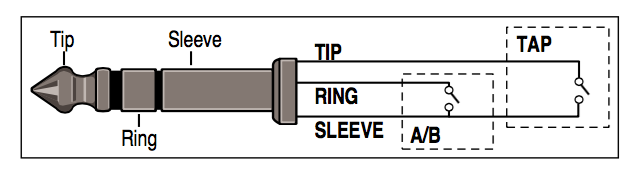

MIDI Clock to footswitch-tapper
===============================

This Teensyduino code takes a MIDI Clock signal received via Teensy's USB MIDI mode, and opens and closes a relay in time with the clock. I use it to set the TAP delay time on a Lexicon Vortex effects box.

Wiring
------

```
+-----------------+       +-------------+     +----------------+
|              GND|-------|GND       GND|-----|SLEEVE 1/4 inch |                       +-------------------+
|     Teensy  PIN0|-------|IN1 Relay VCC|-----|TIP      jack   |-----GUITAR CABLE------|TAP Lexicon Vortex |
|             VUSB|-------|VCC          |     +----------------+                       +-------------------+
+-----------------+       +-------------+                       
```




Video of an earlier Arduino prototype: https://vine.co/v/en5lijptJU2

Parts
-----

* Teensy 3.1: http://www.amazon.com/gp/product/B00NC42Y64
* Relay module: http://www.amazon.com/gp/product/B0057OC6D8
* 1/4 inch jack socket: http://www.amazon.com/gp/product/B00CO6Q1II
* Stereo 1/4 inch patch cable: http://www.amazon.com/gp/product/B00IPNR64M
